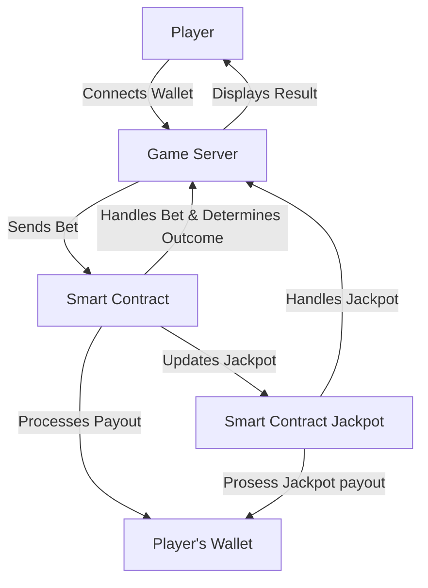

# 🎰 VKZV Crypto Slot Machine Game

## Overview

**VKZV Game** is a decentralized slot machine game leveraging the Ethereum blockchain. Players can connect their crypto wallets, place bets, and spin the slot machine for a chance to win. The game logic, including bet handling, win/loss determination, and payouts, is managed by an Ethereum smart contract deployed using Ganache. The jackpot amount is accumulated and managed directly within the smart contract, with automatic payouts for any winnings.

## Features

- **Crypto Wallet Integration**: Connect your MetaMask wallet to play the game.
- **Decentralized Game Logic**: Win/loss calculation and payouts managed by an Ethereum smart contract.
- **Automatic Payouts**: Winnings are transferred directly to the player's wallet.
- **Jackpot System**: Accumulating jackpot that triggers a payout under specific conditions.
- **Secure Transactions**: All bets and payouts are handled securely using smart contracts.

## Technologies Used

- **Frontend**: HTML, CSS, JavaScript
- **Blockchain**: Ganache, MetaMask, Solidity
- **Backend**: Node.js, MongoDB (for logging and additional server-side operations)

## System Architecture

- **Player**: User who interacts with the slot machine game via their crypto wallet (MetaMask).
- **Smart Contract**: Ethereum-based contract deployed on Ganache, handling the game's core logic.
- **Crypto Wallet (MetaMask)**: Used for sending bets and receiving payouts.
- **Game Server**: Node.js server managing the game frontend and communicating with the smart contract.
- **Database (MongoDB)**: Stores game logs and user activity data.

## Use Case Diagram

# Actors
- **Player**: Connects their wallet, places bets, and interacts with the game.
- **Smart Contract**: Executes the core game logic, including win/loss determination and jackpot management.
- **Crypto Wallet (MetaMask)**: Facilitates player transactions (placing bets, receiving payouts).
- **Game Server**: Handles the game interface and communicates with the smart contract backend.
## Usage
- **Connect Wallet**: Click "Connect Wallet" on the game interface and authorize MetaMask.
- **Place a Bet**: Enter the bet amount and click "Spin".
- **View Results**: The outcome of the spin is displayed, and any winnings are automatically transferred to your wallet.
- **Check Jackpot**: The current jackpot amount is displayed on the game interface.

